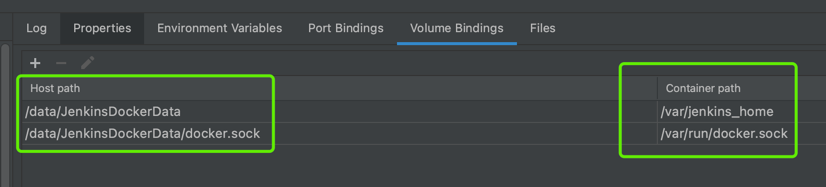
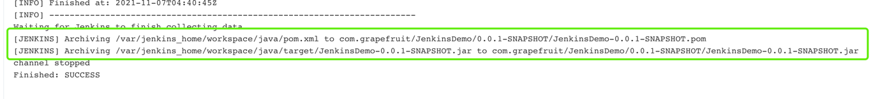

### 部署服务

>1 代码提交到github仓库

>2 运行jenkins-构建mavne工程(配置代码仓库 git://github.com/zzh-1992/JenkinsDemo.git及Credentials)

>3 在主机找到jar包位置使用dockerfile创建镜像

jenkins目录挂载

jenkins构建的包目录

        docker build -t jenkinsdemo/jenkinsdemo:1.0 .

>4 使用镜像创建容器

        docker run --name jenkinsdemo -d -p 8888:8080 jenkinsdemo/jenkinsdemo:1.0
